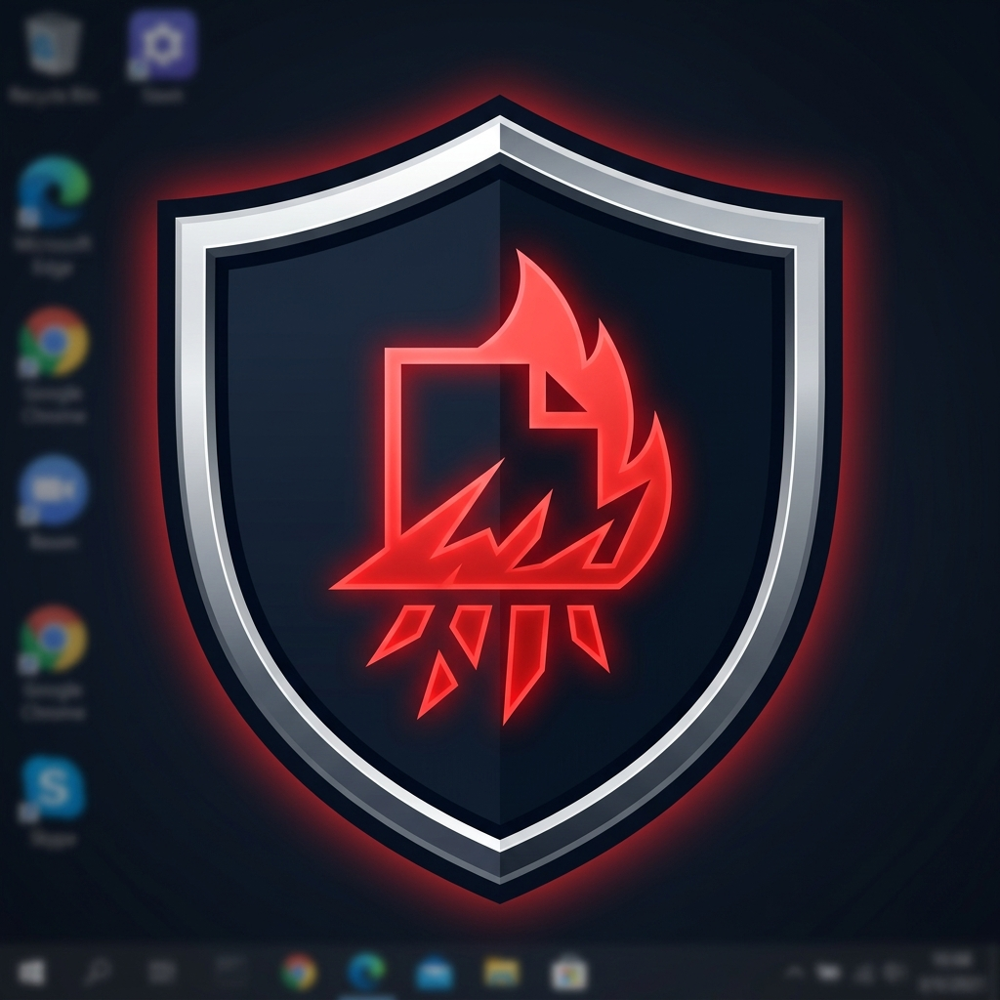

<div align="center">



# 🛡 SecureDelete

**Professional Secure File Shredder & Privacy Cleaner for Windows**

[](https://python.org)
[](https://microsoft.com/windows)
[](LICENSE)
[](https://github.com/amitsethiz/SecureDelete/releases)

*Permanently destroy files, wipe free space, clean browser history, and recover deleted files — all from one sleek dark UI.*

</div>

---

## 📋 Table of Contents

- [Overview](#overview)
- [Features](#features)
- [Screenshots](#screenshots)
- [Download & Run (No Python Needed)](#download--run-no-python-needed)
- [Run from Source](#run-from-source)
- [CLI Usage](#cli-usage)
- [How It Works](#how-it-works)
- [Build Your Own EXE](#build-your-own-exe)
- [Project Structure](#project-structure)
- [Requirements](#requirements)
- [Security Notes](#security-notes)
- [Contributing](#contributing)

---

## Overview

SecureDelete goes beyond simply moving files to the Recycle Bin or deleting them with `Del`. When Windows "deletes" a file, it only removes the pointer to the data — the actual bytes remain on disk and are trivially recoverable with any forensic tool.

**SecureDelete overwrites the file data multiple times before deletion**, making recovery practically impossible. It is designed for:

- Permanently destroying sensitive documents, credentials, or personal files
- Wiping free space to destroy previously deleted files
- Cleaning browser history, cookies, cache, and system traces
- Recovering files from the Recycle Bin or via raw disk carving

> ⚡ Requires Administrator privileges — automatically requested on launch.

---

## Features

### 🔥 Shred Files & Folders
- Select individual files or entire folders
- **1, 3, or 7 overwrite passes** (DoD 5220.22-M standard at 7 passes)
- Each pass: zeros → ones → cryptographically random data
- Filename is randomized before deletion to destroy MFT records
- Works on read-only files (attributes cleared automatically)

### 🧹 Wipe Free Space
- Fills all unused disk space with random data
- Makes previously deleted files **unrecoverable**
- Supports all Windows drives (C:, D:, etc.) + Android devices via ADB
- Real-time progress bar with speed and ETA
- Stoppable mid-wipe at any time

### 🔒 Privacy Cleaner
- **System Traces** — Windows Temp, Prefetch, Recent Files, Explorer thumbnails, Jump Lists
- **Event Logs** — Clears 1000+ Windows Event Log channels (admin required)
- **Browser History** — Shreds cache, cookies, history, and session data for:
  - Google Chrome
  - Microsoft Edge
  - Brave Browser
  - Mozilla Firefox
  - Opera
- Extensions and bookmarks are **always preserved**
- Real-time progress with space-freed summary

### ♻️ File Recovery
- **Recycle Bin Recovery** — Browse, select, and restore deleted items with one click
- **Deep Scan (Disk Carver)** — Raw sector-by-sector signature scan to recover:
  - JPEG images (`.jpg`)
  - PNG images (`.png`)
  - PDF documents (`.pdf`)
  - ZIP archives (`.zip`)
- Configurable scan limit (MB) or full drive scan
- Recovered files saved to `Recovered_Files/` folder

---

## Download & Run (No Python Needed)

> The compiled `.exe` is fully self-contained — **no Python, no dependencies, nothing to install**.

1. Go to [**Releases**](https://github.com/amitsethiz/SecureDelete/releases)
2. Download `SecureDelete.exe`
3. Double-click it
4. Click **Yes** on the UAC Admin prompt
5. Done — the app opens immediately

---

## Run from Source

### Prerequisites

- Python 3.10 or newer
- Windows 10 or Windows 11

### Setup

```bash
# Clone the repository
git clone https://github.com/amitsethiz/SecureDelete.git
cd SecureDelete

# Install runtime dependencies
pip install customtkinter>=5.2.0
```

### Launch GUI

```bash
python securedelete_gui.py
```

> The app will auto-elevate to Administrator. If not running as admin, it will re-launch itself with UAC prompt.

---

## CLI Usage

SecureDelete also ships a full-featured **command-line interface** via `securedelete.py`.

### Shred Files

```bash
# Shred a single file
python securedelete.py shred secret.txt

# Shred multiple files
python securedelete.py shred file1.txt file2.pdf report.docx

# Shred an entire folder recursively
python securedelete.py shred "C:\Secrets" -r

# Shred with glob pattern
python securedelete.py shred *.log

# 7-pass DoD shred, no confirmation prompt
python securedelete.py shred secret.txt -p 7 --force
```

**Shred options:**

| Flag | Description |
|------|-------------|
| `-p N` / `--passes N` | Number of overwrite passes (default: 3) |
| `-r` / `--recursive` | Shred directories recursively |
| `-f` / `--force` | Skip confirmation prompt |

### Wipe Free Space

```bash
# Wipe free space on C: drive (3-pass default)
python securedelete.py wipe C:

# 7-pass maximum security wipe
python securedelete.py wipe C: -p 7

# Wipe a specific drive
python securedelete.py wipe D: -p 1
```

**Wipe options:**

| Flag | Description |
|------|-------------|
| `-p N` / `--passes N` | Overwrite passes (default: 3) |

### Privacy Cleanup

```bash
# Clean all browser histories
python securedelete.py clean --browsers

# Clean Windows system traces (temp, prefetch, recent)
python securedelete.py clean --system

# Clear Windows Event Logs (requires admin)
python securedelete.py clean --logs

# Full cleanup — browsers + system + logs
python securedelete.py clean --browsers --system --logs
```

### File Recovery

```bash
# List items in the Recycle Bin
python securedelete.py recover --list

# Recover all items from the Recycle Bin
python securedelete.py recover

# Recover specific files from Recycle Bin
python securedelete.py recover --targets "secret.txt" "report.pdf"

# Deep raw scan on C: drive (up to 1 GB)
python securedelete.py recover --deep C: --limit 1024

# Full drive deep scan (no limit)
python securedelete.py recover --deep C: --limit 0
```

---

## How It Works

### File Shredding Algorithm

```
1. Clear read-only / system attributes
2. For each pass (1 to N):
   a. Pass 1  → overwrite with 0x00 (all zeros)
   b. Pass 2  → overwrite with 0xFF (all ones)
   c. Pass 3+ → overwrite with cryptographically random bytes (secrets.token_bytes)
   d. Flush to disk (fsync) after each pass
3. Rename file to random 16-character name × 3 times (destroys filename in MFT)
4. Truncate to zero length
5. Delete the file
```

### Free Space Wiper

```
1. Create a hidden temp directory on the target drive
2. Write large random-data files until the drive is full
3. Repeat for each pass
4. Delete the temp files
```

### Disk Carver (Deep Scan)

Reads raw drive sectors in 4 MB chunks and searches for file signatures:

| Type | Start Signature | End Signature |
|------|----------------|---------------|
| JPEG | `FF D8 FF` | `FF D9` |
| PNG  | `89 50 4E 47 0D 0A 1A 0A` | `49 45 4E 44 AE 42 60 82` |
| PDF  | `25 50 44 46 2D` | `25 25 45 4F 46` |
| ZIP  | `50 4B 03 04` | `50 4B 05 06` |

---

## Build Your Own EXE

If you've modified the source and want to produce a fresh `.exe`:

### Option A — Double-click (easiest)

```
build.bat
```

### Option B — Terminal

```bash
# Install build dependencies
pip install pyinstaller pillow

# Build
python -m PyInstaller build.spec --clean --noconfirm
```

Output: `dist\SecureDelete.exe` (~19 MB, fully self-contained)

### Build configuration (`build.spec`)

| Setting | Value |
|---------|-------|
| Output type | Single-file EXE |
| Console window | Hidden (pure GUI) |
| UAC elevation | Embedded admin manifest |
| Icon | `icon.ico` (multi-resolution shield) |
| Compression | UPX |
| CTk assets | Fully bundled (`collect_all`) |

---

## Project Structure

```
SecureDelete/
│
├── securedelete_gui.py      # Main GUI application (customtkinter)
├── securedelete.py          # Core backend + CLI entry point
│
├── build.bat                # One-click EXE build script
├── build.spec               # PyInstaller build configuration
├── version_info.txt         # Windows EXE version metadata
├── icon.png                 # App icon (source PNG)
├── icon.ico                 # App icon (Windows multi-resolution ICO)
│
├── requirements.txt         # Python dependencies
├── .gitignore               # Excludes dist/, build/, test artifacts
│
└── dist/
    └── SecureDelete.exe     # Compiled output (git-ignored)
```

---

## Requirements

### Runtime (from source)
| Package | Version |
|---------|---------|
| Python | ≥ 3.10 |
| customtkinter | ≥ 5.2.0 |

### Build (to compile .exe)
| Package | Version |
|---------|---------|
| pyinstaller | ≥ 6.0.0 |
| pillow | ≥ 10.0.0 |

### System
- Windows 10 or Windows 11 (64-bit)
- Administrator privileges (required for shredding system files, event logs, raw disk access)
- PowerShell (built-in) — used for Recycle Bin operations

---

## Security Notes

| Concern | How SecureDelete handles it |
|---|---|
| **PowerShell injection** | Recycle Bin paths are passed via environment variables, never interpolated into script strings |
| **Read-only files** | `stat.S_IWRITE` is set before opening for write — no silent skips |
| **Random data quality** | Uses Python's `secrets.token_bytes()` (CSPRNG), not `random` |
| **MFT filename traces** | File is renamed to a random name 3× before deletion |
| **UAC elevation** | Embedded manifest (`uac_admin=True`) — no runtime `ShellExecuteW` tricks in the packaged EXE |
| **ADB path** | Resolved via `ADB_PATH` env var → system PATH → common locations. No hardcoded user paths |

> ⚠️ **No tool can guarantee 100% unrecoverability on SSDs** due to wear-levelling and over-provisioning. For maximum security on SSDs, use the free space wiper in addition to file shredding.

---

## Contributing

1. Fork the repository
2. Create a feature branch: `git checkout -b feature/my-feature`
3. Commit your changes: `git commit -m "feat: describe your change"`
4. Push to your fork: `git push origin feature/my-feature`
5. Open a Pull Request

---

<div align="center">

Made with ❤️ for privacy and security.

**[⬆ Back to top](#-securedelete)**

</div>
