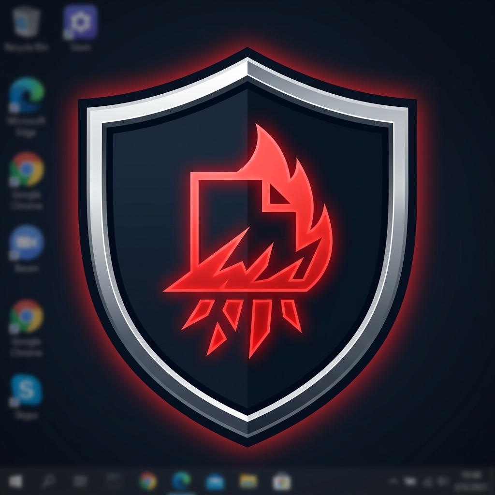

<div align="center">



# 🛡 SecureDelete

**Professional Secure File Shredder & Privacy Cleaner for Windows**

[](https://python.org)
[](https://microsoft.com/windows)
[](LICENSE)
[](https://github.com/amitsethiz/SecureDelete/releases)
[](#automated-tests)

*Permanently destroy files, wipe free space, clean browser history, and recover deleted files — all from one sleek dark UI.*

</div>

---

## 📋 Table of Contents

- [Overview](#overview)
- [Features](#features)
- [Download & Run (No Python Needed)](#download--run-no-python-needed)
- [Run from Source](#run-from-source)
- [CLI Usage](#cli-usage)
- [How It Works](#how-it-works)
- [Build Your Own EXE](#build-your-own-exe)
- [Automated Tests](#automated-tests)
- [Project Structure](#project-structure)
- [Requirements](#requirements)
- [Security Notes](#security-notes)
- [Contributing](#contributing)

---

## Overview

SecureDelete goes beyond simply moving files to the Recycle Bin or deleting them with `Del`. When Windows "deletes" a file, it only removes the pointer to the data — the actual bytes remain on disk and are trivially recoverable with any forensic tool.

**SecureDelete overwrites the file data multiple times before deletion**, making recovery practically impossible. It is designed for:

- Permanently destroying sensitive documents, credentials, or personal files
- Wiping free space to destroy previously deleted files
- Cleaning browser history, cookies, cache, and system traces
- Recovering files from the Recycle Bin or via raw disk carving

> ⚡ Requires Administrator privileges — automatically requested on launch.

---

## Features

### 🔥 Shred Files & Folders
- Select individual files or entire folders via GUI or CLI
- **1, 3, or 7 overwrite passes** (DoD 5220.22-M standard at 7 passes)
- Each pass: zeros → ones → cryptographically random data
- Filename randomized 3× before deletion to destroy MFT records
- Works on read-only files (attributes cleared automatically)
- SSD-aware warning — advises full-drive encryption for solid-state media

### 🧹 Wipe Free Space
- Fills all unused disk space with random data
- Makes previously deleted files **unrecoverable**
- Supports all Windows drives (C:, D:, etc.) + Android devices via ADB
- **Real-time overall progress bar** across all passes with speed and ETA
- Stoppable mid-wipe at any time
- Optional `cipher /w:` MFT record cleanup (`--cipher`)

### 🔒 Privacy Cleaner
- **System Traces** — Windows Temp, Prefetch, Recent Files, Explorer thumbnails, Jump Lists, INetCache, Crash Dumps, DNS cache
- **Event Logs** — Clears 1000+ Windows Event Log channels (admin required)
- **Browser History** — Shreds cache, cookies, history, session data, autofill for:
  - Google Chrome, Microsoft Edge, Brave, Mozilla Firefox
  - Opera, Opera GX, Vivaldi, Chromium
  - Waterfox, LibreWolf, IE Legacy
- Extensions, bookmarks and saved passwords are **always preserved**
- **Select All / Deselect All** controls for both System and Browser columns
- Real-time progress bar with space-freed summary

### ♻️ File Recovery
- **Recycle Bin Recovery** — Browse, select, and restore deleted items with one click
- **Deep Scan (Disk Carver)** — Raw sector-by-sector signature scan to recover:

| Type | Extension |
|------|-----------|
| JPEG images | `.jpg` |
| PNG images | `.png` |
| PDF documents | `.pdf` |
| ZIP archives | `.zip` |
| Office documents (DOCX/XLSX/PPTX) | `.docx` |
| MP4 video | `.mp4` |
| MP3 audio | `.mp3` |
| SQLite databases | `.sqlite` |

- Filter by file type with `--file-types jpg,pdf,mp4`
- Configurable scan limit (MB) or full drive scan
- Recovered files saved to `Recovered_Files/` folder

### 📋 Audit Trail
- `--log FILE` flag on `shred`, `wipe`, and `clean` writes a full timestamped audit log
- Useful for compliance and verification purposes

---

## Download & Run (No Python Needed)

> The compiled `.exe` is fully self-contained — **no Python, no dependencies, nothing to install**.

1. Go to [**Releases**](https://github.com/amitsethiz/SecureDelete/releases)
2. Download `SecureDelete.exe` from the latest release
3. Double-click it
4. Click **Yes** on the UAC Admin prompt
5. Done — the app opens immediately

---

## Run from Source

### Prerequisites

- Python 3.10 or newer
- Windows 10 or Windows 11

### Setup

```bash
# Clone the repository
git clone https://github.com/amitsethiz/SecureDelete.git
cd SecureDelete

# Install runtime dependencies
pip install customtkinter>=5.2.0
```

### Launch GUI

```bash
python securedelete_gui.py
```

> The app will auto-elevate to Administrator. If not running as admin, it will re-launch itself with a UAC prompt.

---

## CLI Usage

SecureDelete also ships a full-featured **command-line interface** via `securedelete.py`.

### Check Version

```bash
python securedelete.py --version
# SecureDelete 1.0
```

### Shred Files

```bash
# Shred a single file
python securedelete.py shred secret.txt

# Shred multiple files
python securedelete.py shred file1.txt file2.pdf report.docx

# Shred an entire folder recursively
python securedelete.py shred "C:\Secrets" -r

# Shred with glob pattern
python securedelete.py shred *.log

# 7-pass DoD shred, no confirmation prompt
python securedelete.py shred secret.txt -p 7 --force

# Shred and write audit log
python securedelete.py shred secret.txt --log shred_audit.txt
```

**Shred options:**

| Flag | Description |
|------|-------------|
| `-p N` / `--passes N` | Number of overwrite passes (default: 3) |
| `-r` / `--recursive` | Shred directories recursively |
| `-f` / `--force` | Skip confirmation prompt |
| `--log FILE` | Append full audit trail to FILE |

### Wipe Free Space

```bash
# Wipe free space on C: drive (3-pass default)
python securedelete.py wipe C:

# 7-pass maximum security wipe
python securedelete.py wipe C: -p 7

# Wipe + MFT record cleanup (requires admin)
python securedelete.py wipe C: --cipher

# Dry run — simulate without writing
python securedelete.py wipe C: --dry-run

# Wipe and write audit log
python securedelete.py wipe C: --log wipe_audit.txt
```

**Wipe options:**

| Flag | Description |
|------|-------------|
| `-p N` / `--passes N` | Overwrite passes (default: 3) |
| `--cipher` | Also run `cipher /w:` for MFT cleanup (admin required) |
| `--dry-run` | Simulate the wipe without writing data |
| `--log FILE` | Append full audit trail to FILE |

### Privacy Cleanup

```bash
# Clean all browser histories
python securedelete.py clean --browsers

# Clean Windows system traces (temp, prefetch, recent)
python securedelete.py clean --system

# Clean IE/Edge Legacy cache
python securedelete.py clean --inet

# Shred crash dumps and WER reports
python securedelete.py clean --crash-dumps

# Flush DNS resolver cache
python securedelete.py clean --dns

# Shred Explorer thumbnail cache
python securedelete.py clean --thumbnails

# Clear Windows Event Logs (requires admin)
python securedelete.py clean --logs

# Full cleanup — everything
python securedelete.py clean --browsers --system --inet --crash-dumps --dns --thumbnails --logs

# Full cleanup with audit log
python securedelete.py clean --browsers --system --log cleanup_audit.txt
```

**Clean options:**

| Flag | Description |
|------|-------------|
| `--system` | Shred system temp, prefetch, and recent items |
| `--browsers` | Shred browser cache, history, and cookies |
| `--inet` | Shred IE / Edge-Legacy INetCache and WebCache |
| `--crash-dumps` | Shred Windows crash-dump and WER report files |
| `--dns` | Flush the Windows DNS resolver cache |
| `--thumbnails` | Shred Explorer thumbnail cache (thumbcache_*.db) |
| `--logs` | Clear Windows Event Logs (requires admin) |
| `-p N` / `--passes N` | Overwrite passes (default: 3) |
| `--log FILE` | Append full audit trail to FILE |

### File Recovery

```bash
# List items in the Recycle Bin
python securedelete.py recover --list

# Recover all items from the Recycle Bin
python securedelete.py recover

# Recover specific files from Recycle Bin
python securedelete.py recover "secret.txt" "report.pdf"

# Deep raw scan on C: drive (up to 1 GB)
python securedelete.py recover --deep C: --limit 1024

# Full drive deep scan (no limit)
python securedelete.py recover --deep C: --limit 0

# Deep scan for specific file types only
python securedelete.py recover --deep C: --file-types jpg,pdf,mp4

# Deep scan for SQLite databases only
python securedelete.py recover --deep C: --file-types sqlite --limit 2048
```

**Recover options:**

| Flag | Description |
|------|-------------|
| `-l` / `--list` | List Recycle Bin items without recovering |
| `-f` / `--force` | Skip confirmation prompt |
| `--deep DRIVE` | Perform raw disk signature carve (e.g. `C:`) |
| `--limit MB` | Max MB to scan (default: 1024, 0 = full drive) |
| `--file-types TYPES` | Comma-separated types: `jpg,png,pdf,zip,docx,mp4,mp3,sqlite` |

---

## How It Works

### File Shredding Algorithm

```
1. Clear read-only / system attributes
2. For each pass (1 to N):
   a. Pass 1  → overwrite with 0x00 (all zeros)
   b. Pass 2  → overwrite with 0xFF (all ones)
   c. Pass 3+ → overwrite with cryptographically random bytes (secrets.token_bytes)
   d. Flush to disk (fsync) after each pass
3. Rename file to random 16-character name × 3 times (destroys filename in MFT)
4. Truncate to zero length
5. Delete the file
```

### Free Space Wiper

```
1. Create a hidden temp directory on the target drive
2. Write large data files (zeros / ones / random) until the drive is full
3. Overall progress tracked across all passes (not reset per pass)
4. Repeat for each pass, then delete temp files
5. Optionally run cipher /w: for MFT cleanup
```

### Disk Carver (Deep Scan)

Reads raw drive sectors in 4 MB chunks with 2 MB overlap and searches for file signatures:

| Type | Start Signature | End Signature | Max Size |
|------|----------------|---------------|----------|
| JPEG | `FF D8 FF` | `FF D9` | 20 MB |
| PNG  | `89 50 4E 47 0D 0A 1A 0A` | `49 45 4E 44 AE 42 60 82` | 20 MB |
| PDF  | `25 50 44 46 2D` | `25 25 45 4F 46` | 50 MB |
| ZIP / DOCX | `50 4B 03 04` | `50 4B 05 06` | 50 MB |
| MP4  | `66 74 79 70` | `6D 64 61 74` | 500 MB |
| MP3  | `49 44 33` | `FF E0` | 30 MB |
| SQLite | `53 51 4C 69 74 65 20 66 6F 72 6D 61 74 20 33 00` | `00 00 00 00` | 100 MB |

---

## Build Your Own EXE

If you've modified the source and want to produce a fresh `.exe`:

### Option A — Double-click (easiest)

```
build.bat
```

### Option B — Terminal

```bash
# Install build dependencies
pip install pyinstaller pillow customtkinter

# Build
python -m PyInstaller build.spec --clean --noconfirm
```

Output: `dist\SecureDelete.exe` (~29 MB, fully self-contained)

### Build configuration (`build.spec`)

| Setting | Value |
|---------|-------|
| Output type | Single-file EXE |
| Console window | Hidden (pure GUI) |
| UAC elevation | Embedded admin manifest |
| Icon | `icon.ico` (multi-resolution shield) |
| Compression | UPX |
| CTk assets | Fully bundled (`collect_all`) |

---

## Automated Tests

The test suite covers all core logic with 36 tests, zero external dependencies.

```bash
# Run all tests
python test_securedelete.py

# Or with pytest (if installed)
python -m pytest test_securedelete.py -v
```

**Coverage:**

| Area | Tests |
|------|-------|
| `format_bytes` / `format_time` | Boundary values, unit transitions |
| `make_fill_data` | Pass 1 zeros, pass 2 ones, pass 3+ random, lengths |
| `random_name` | Length, alphanumeric-only, uniqueness across 100 calls |
| `shred_file` | Delete verified, multi-pass, empty file, 5 MB file, nonexistent path |
| `shred_directory` | Flat and nested directories, nonexistent path |
| `carve_drive` | JPG / PDF / SQLite recovery from mock images, no-match, stop event |
| `VERSION` | Constant exists, is a non-empty string |
| `_TeeStream` | Tees to both terminal and log, flush works |

---

## Project Structure

```
SecureDelete/
│
├── securedelete_gui.py      # Main GUI application (customtkinter)
├── securedelete.py          # Core backend + CLI entry point
├── test_securedelete.py     # Automated test suite (36 tests)
│
├── build.bat                # One-click EXE build script
├── build.spec               # PyInstaller build configuration
├── version_info.txt         # Windows EXE version metadata
├── icon.png                 # App icon (source PNG)
├── icon.ico                 # App icon (Windows multi-resolution ICO)
│
├── requirements.txt         # Python dependencies
└── .gitignore               # Excludes dist/, build/, test artifacts
```

---

## Requirements

### Runtime (from source)
| Package | Version |
|---------|---------|
| Python | ≥ 3.10 |
| customtkinter | ≥ 5.2.0 |

### Build (to compile .exe)
| Package | Version |
|---------|---------|
| pyinstaller | ≥ 6.0.0 |
| pillow | ≥ 10.0.0 |

### System
- Windows 10 or Windows 11 (64-bit)
- Administrator privileges (required for shredding system files, event logs, raw disk access)
- PowerShell (built-in) — used for Recycle Bin operations

---

## Security Notes

| Concern | How SecureDelete handles it |
|---|---|
| **PowerShell injection** | Recycle Bin paths passed via environment variables, never interpolated into scripts |
| **Shell injection** | `cipher /w:` runs via `subprocess.run(["cipher", ...])`, not `os.system()` |
| **Read-only files** | `stat.S_IWRITE` set before opening — no silent skips |
| **Random data quality** | Uses Python's `secrets.token_bytes()` (CSPRNG), not `random` |
| **MFT filename traces** | File renamed to random name 3× before deletion |
| **UAC elevation** | Embedded manifest (`uac_admin=True`) — no ShellExecuteW tricks in the packaged EXE |
| **ADB path** | Resolved via `ADB_PATH` env var → system PATH → common locations. No hardcoded user paths |
| **Audit logging** | `--log FILE` tees all output to a timestamped log; encoding-safe on narrow terminals |

> ⚠️ **SSDs & NVMe drives:** Overwrite-based shredding is **not fully reliable** on solid-state media due to wear-levelling and internal drive remapping. For maximum security, use full-drive encryption (e.g. BitLocker) before storing sensitive data, and use the free space wiper in addition to file shredding.

---

## Contributing

1. Fork the repository
2. Create a feature branch: `git checkout -b feature/my-feature`
3. Commit your changes: `git commit -m "feat: describe your change"`
4. Push to your fork: `git push origin feature/my-feature`
5. Open a Pull Request

---

<div align="center">

Made with ❤️ for privacy and security.

**[⬆ Back to top](#-securedelete)**

</div>
